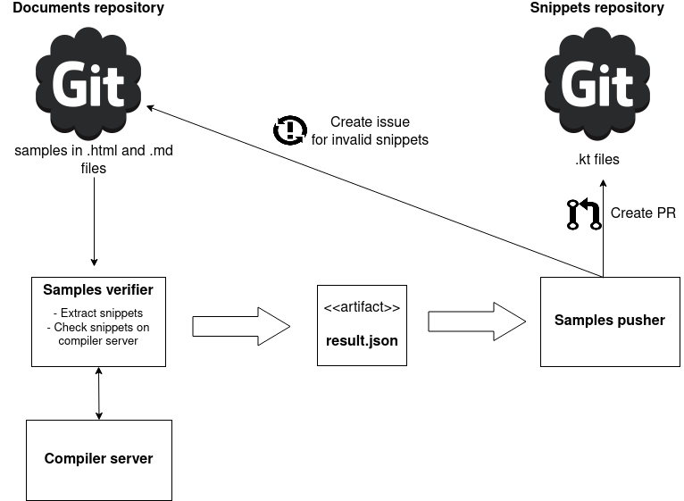

# Kotlin Samples Pushes

It aims to handle snippets collection for their consistency in the repository.




### Options:
  | Name (alias) | Format | Description | Default |
  | ------------- |:-------------:| :-----:|:-------------:|
  |-username| [String] | Username or access token for push to a target repository (**required**) | n/a |
  |-passw | [String] | User's password for push  to a target repository | empty |
  |-path (p) | [String] | Path relatively a target repository | empty |
  |-push-repository (-pr) | [String] | Destination git repository to push (**required**)| n/a |
  
  Other options is for the verifier. 
  See https://github.com/AlexanderPrendota/kotlin-samples-verifier
  
### Templates:
It is possible to customize the title, body of issue or pull request.
 Templates of issue or pull request are stored in ```templates/issue.md``` and ```templates/pr.md``` resp.
 
 See https://freemarker.apache.org/docs/index.html